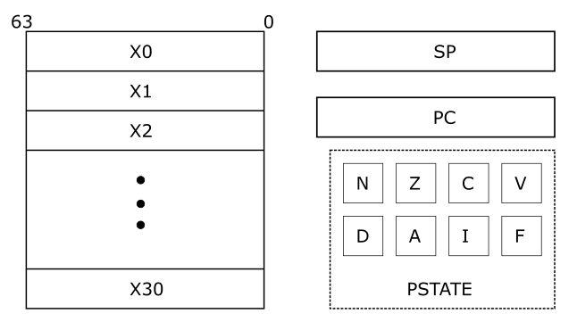

# ARM Registers and Processor Execution State

CPU Cores, also called processors, are programmable hardware that can perform computation. Programmable meaning they can be given a set of instructions - encoded as bits - and they will perform the computation as directed in the instructions.

What instructions can a programmer give the processor? What resources does the processor have to execute those instructions? These are defined in the processor's architecture. The architecture of ARM processors are specified in the ARM Architecture Reference Manual (see References). The architecture also specifies the instructions that the processor is capable of understanding.

Programmers use these instructions to write programs in assembly language. In subsequent chapters we will learn how to use ARM assembly language to program the processor. This section provides an overview of the resources that an ARM processor has at its disposal to aid in performing computation.

The two resources available to programmers are registers and PSTATE. Registers allow programmers to store a limited amount of data. Instructions can perform operations on register values. The output values generated by instructions are also stored in registers.

Data can also be stored in memory. Usually (almost always), the amount of data that can be stored in memory is much larger than what can be stored in registers. However, in the ARM architecture computational instructions cannot directly operate on data in memory. They can only operate on register values. Special instructions, called Load/Store instructions, are used to transfer data between memory and registers. 

## ARM Registers

The architecture provides programmers with **31 general purpose registers**. These registers store inputs for computation and the output. They may also be used to store intermediate results of computations.

For example, if a program is used to compute the function:

> L = (A + B) * K

Registers can be used to hold the values of A, B, and K. Another register can be used to hold the value of the result (L). The result of the addition (A + B) is a temporary value in this context. It is needed to compute the final answer but not necessary after that. This temporary value can also be stored in a register.

The 31 general purpose registers are 64-bits wide. But they can be used either as 64-bit or as 32-bit registers. The registers are named X0-X30 when they are referred to in 64-bit form. They are named W0-W30 when referred to in 32-bit form. From a programmer's perspective, general purpose registers are locations that can be used to store data. The programmer may write to, read from, and re-write registers as required to accomplish their end goal.

The X30 register has a special function. It is used as a link register for procedure calls. The specifics of this function are explained in later chapters.




The general purpose registers can be used by Integer and Logic operation instructions. Another set of 32 registers are available for use with floating-point and SIMD instructions. We will not be using those instructions in this book, the interested reader can consult the ARM architecture reference manual for details.

There are two additional registers with specific functions - stack pointer (SP) and program counter (PC). They cannot be used for general purpose computation. The SP register is a 64-bit register that points to the current "top of stack". The chapter on Functions will explain this use of this register. The PC register is a 64-bit register that holds the address of the current instruction being executed. This register cannot be written to directly. It is updated by the processor when a branch instruction is executed and on exception entry/return. We will learn more about control flow and exceptions later in this book.


Here is the pseudo code for the operation  L = (A + B) * K:  
```
1. Load K into X0
2. Load A into X1
3. Load B into X2
4. X3 = X1 + X2
5. X0 = X3 * X0   #result is left in X0
```

## ARM Process State (PSTATE)

In addition to registers the architecture also provides some *state* that records information related to computation and exceptions. The process state (PSTATE) comprises of:
   - Condition flags
   - Exception masking bits

There are four condition flags:

| Flag | Desc |
|---- | ---- |
| N | Negative flag |
| Z | Zero flag |
| C | Carry flag |
| V | Overflow flag |

These flags are 1-bit each, so they can have only values of 0 (clear) or 1 (set). **Certain instructions in the ISA set these flags if the computation results in specific conditions.**

The N flag represents the sign of the result of the previous operation. If say the operation was an addition (or subtraction, multiplication, division etc.) and the result was a negative number then this flag is set. If the result was a positive number then this flag is cleared.

The Z flag, when set, indicates that the output of the previous instruction was zero. 

The C flag is called the carry flag. This flag is set if an arithmetic operation results in an arithmetic *carry* or *borrow*. The V flag indicates that the previous operation resulted in an arithmetic *overflow*. The explanation for when these flags are set/cleared requires an understanding of binary arithmetic and therefore will be provided in the corresponding section.


The PSTATE includes four exception masking bits.

| Exception Masking | Description |
|---- | ---- |
| D | Debug exception mask  |
| A | SError interrupt mask |
| I | IRQ interrupt mask |
| F | FIQ interrupt mask |

We will discuss exceptions and masking exceptions in part 2 of this book (not yet available). For now, just know that they are part of the PSTATE.


## What we learned this chapter
   1. ARM general purpose registers 
   2. ARM PSTATE

