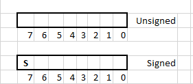

# Binary Representation of Integers

This section we will learn about number representation using the binary system. Representation only governs how numbers are represented for writing, storing in memory etc. It makes no difference to the result of arithmetic operations. Meaning that arithmetic operations like addition, subtraction, multiplication, and division will have the same result regardless of whether the representation is in decimal, binary, hexadecimal, octal etc.

We are used to counting using the decimal number system. This system has ten symbols (decimal numerals) to represent numbers, namely - 0 1 2 3 4 5 6 7 8 9. Of course, using these symbols we can represent values greater than ten. For example, after counting from 0 till 9 we run out of symbols for ten. To represent ten and higher numbers more than one of those symbols is used - 10, 11, 12...10521... etc. A special symbol is pre-fixed to numbers to represent negative numbers (-1, -2, -3... etc.).

OK, so all of this number representation is elementary school material. What is the point of all this? The main point is that numbers are represented with symbols. Modern computers use *binary*  representation for storing and operating on numbers. The decimal number format uses 10 symbols (11 actually if you count the minus sign for negative numbers) the binary number format uses just two symbols.

Therefore, when working with computers at the lowest level, it is important to know how numbers are represented and how arithmetic operations are performed in binary .


---

**Note:**

Are there computers that use representations other than binary? There were a few that used ternary logic (i.e. base: 3). However, all computers that one is likely to encounter today use binary representation. Ternary and other base forms are outside the scope of this book.


---

Remember - representation only governs how numbers are represented for writing, storing in memory etc. It makes no difference to the result of arithmetic operations. 


## Binary Representation

The binary number system uses two numerals - 0 and 1. So, just like in the decimal system, more than one of those symbols are needed to represent 2 and greater. The table below shows decimal numbers and their equivalent binary:

|Decimal | Binary |
| ------ | ------ |
| 0 | 0b0 |
| 1 | 0b1 |
| 2 | 0b10 |
| 3 | 0b11 |
| 4 | 0b100 |
| 5 | 0b101 |
| 6 | 0b110 |
| 7 | 0b111 |
| 8 | 0b1000 |
| 9 | 0b1001 |
| 10 | 0b1010 |
| 100 | 0b1100100 |
| 1000 | 0b1111101000 |


When referring to binary numbers in code it is common to prefix it with special characters to indicate the number is in binary representation. The convention is to use the prefix 0b for binary numbers and 0x for hexadecimal numbers. Decimal numbers have no prefix.

In the *decimal system*, all numbers that are powers of 10, are represented with the symbol 1 followed by zero or more 0s. Examples include 1, 10, 100 etc. The position of numerals representing a number is called "decimal place". So a number like say 25 has one decimal numeral in the 10's place and another in the 1's place.

```
25 = 2 * 10^1 + 5 * 10^0

542 = 5 * 10^2 + 4 * 10^1 + 2 * 10^0

Here ^ means raised to the power.
Recall that any number raised to power 0 is 1. So 10^0 is 1.
```

**The binary number system uses base 2.** This means the position of every numeral is a power of 2. Also, in binary representation, numbers that are a power of two are represented with the numeral 1 followed by 0s. This is similar to power of 10 numbers in the decimal system!!

For example, the number 2 in binary is 0b10. Why is that? Because 0b10 is

```
1 * 2^1 + 0 * 2^0 = 2

Here ^ means raised to the power.
```

*Decimal numbers* that are powers of 10 are represented with the numeral 1 followed by the numeral 0. The number of 0s depends on the power of 10. In *binary* the same applies to numbers that are powers of 2. In the table above, the binary equivalent of 2, 4 and 8 all have only one numeral set to 1 and it is followed by 0s.

## Converting From Binary to Decimal and Vice Versa

It is pretty straight forward to convert a number from binary to decimal. All it requires is to multiply the binary numeral with the appropriate power of 2.

For example, the binary number 0b10 can be converted to decimal the following way:
```
Binary number: 0b10

1 * 2^1 + 0 * 2^0 = 2

Decimal: 2
```

Another example,

```
Binary number: 0b1001

1 * 2^3 + 0 * 2^2 + 0 * 2^1 + 1 * 2^0 = 8 + 0 + 0 + 1 = 9

Decimal: 9
```

Converting from decimal to binary is a just a touch more difficult because it requires division. It is done by repeatedly dividing the number and recording the remainder. The division is continued until what remains is 0.

Here is an example of how to convert the decimal number 8 to binary. We divide 8 by 2 successively until the quotient is 0. The quotient and remainder of each step of the division is shown below.

```
Decimal number: 8

	2 | 8
	  ----
	2 | 4  - 0
	  ----
	2 | 2  - 0
	  ----
	2 | 1  - 0
	  ----
	    0  - 1
```

The binary representation is the remainder read backwards. So in this instance it will be  0b1000 (the leading 0 is dropped).


## Practice converting number formats

**Convert from binary to decimal:**

{{#quiz ./quizzes/binary_representation_a.toml}}

**Convert from decimal to binary:**
{{#quiz ./quizzes/binary_representation_b.toml}}


<!---
Convert the following binary numbers to decimal: 0b100, 0b1011, 0b10000, 0b11001


<details>
  <summary>Click here to see answers.</summary>

| Binary | Decimal |
| ------ | ------ |
| 0b100 | 4 |
| 0b1011 | 11 |
| 0b10000 | 16 |
| 0b11001 | 25 |

</details>


Convert the following decimal numbers to binary: 52, 29, 17, 32

<details>
  <summary>Click here to see answers.</summary>

| Decimal | Binary |
| ------ | ------ |
| 52 | 0b110100 |
| 29 | 0b11101 |
| 17 | 0b10001 |
| 32 | 0b100000 |

</details>
-->

## Binary representation in computers

Larger numbers may need more numerals for representation. For example, 0b100000000 (256) requires nine binary digits while 0b1 (1) requires just one binary digit. In practice it is very difficult to implement logic circuitry (adders, multipliers etc.) to operate on numbers with varying number of digits. Therefore, computers use fixed-width representations. This means that numbers are represented with a fixed number of digits. The most common widths are 8-bit (byte), 16-bit (half-word), 32-bit (word), 64-bit (double word).

Fixed-width representations can be used to represent numbers from 0 up to a maximum value. That maximum value is determined using the formula 2<sup>N</sup> - 1, where N is the width. The largest integer that can be represented in 8-bit fixed-width is

```
 2^8 - 1 = 256 - 1 = 255
 8-bit binary number can represent numbers in the range 0-255
```

This is a small number range and computers will be of limited use if all they can represent are numbers from 0 to 255. However, the word and double-word representations can be used to represent **very** large numbers. The maximum value that can be represented with a double-word is

```
2^64 - 1 = 18,446,744,073,709,551,616 - 1 = 18,446,744,073,709,551,615

That is a 20-digit decimal number!!
```

---

**Note:** There are software tricks that can be used to represent numbers with more than 64-bits. We will not encounter such large numbers in any of the exercises in this book.

---

The **minimum** number of bits required to represent a number can be found by computing
log<sub>2</sub>(number) and rounding up to the closest integer. If you do not know the logarithm (log) function that is fine, we will not need to use it extensively in this book. Another way is to find the smallest power of 2 that is **greater** than the given number and then the exponent is the minimum number of bits required to represent that number. For example, the number 9 can be represented using 4 bits. Because 2<sup>4</sup> = 16 is the smallest power of 2 that is greater than 9. Note that 2<sup>3</sup> is 8 and is smaller than 9.
What about the number 8? Well 2<sup>3</sup> is **equal** to 8 and so we cannot represent it with 3 bits because we need the smallest power of 2 that is **greater** than 8. We need 4 bits to represent the number 8.

Now that we know computers use fixed-width representations, the natural question is - what happens when a computation results in a number larger (or smaller) than the representable range?
When using 8-bit numbers, what result is generated when the computer is told to add 1 and 255?

The computation results in a overflow or carry. We will learn more about these concepts in this chapter and revisit them in the chapter on conditional flags.

## Binary Arithmetic - Addition

Binary addition and subtraction are done just like in decimal arithmetic. The basic rules remain the same.

```
 0 + 0 = 0
 0 + 1 = 1
 1 + 0 = 1
 1 + 1 = 10
```

Here is an example of adding 0b101 (5) and 0b11 (3)

   &nbsp;&nbsp;&nbsp;&nbsp; 1<sup>1</sup> 0<sup>1</sup> 1   
   &nbsp;&nbsp;&nbsp;&nbsp; 0 &nbsp;&nbsp;1 &nbsp;&nbsp;1  
\---------------  
  1 &nbsp;&nbsp;0 &nbsp;&nbsp;0 &nbsp;&nbsp;0

Just like in decimal addition we add corresponding digits of the numbers from right to left. If the sum results in a carry (i.e. 1 + 1) then the carry is added to the next number. If the numbers are of dis-similar lengths then 0s are prefixed as required.

When binary arithmetic is performed in digital circuits there is a fixed-width for representing the numbers. So if the sum of the two numbers is larger than what can be represented, some special provision has to be made to indicate to the programmer that the result is incorrect.

For example, when adding the following **4-bit numbers** 0b1111 (15) and 0b0001 (1)

   &nbsp;&nbsp;&nbsp;&nbsp;&nbsp; 1<sup>1</sup> 1<sup>1</sup> 1<sup>1</sup> 1   
   &nbsp;&nbsp;&nbsp;&nbsp;&nbsp; 0 &nbsp;&nbsp;0 &nbsp;&nbsp;0 &nbsp;&nbsp;1  
 &nbsp;&nbsp;&nbsp;&nbsp;&nbsp; \---------------  
  1 |&nbsp;0 &nbsp;&nbsp;0 &nbsp;&nbsp;0 &nbsp;&nbsp;0

Since there are only 4-bits to represent the numbers the result can only hold 0b0000. The fifth and most significant bit is lost. Clearly some indication has to be provided to the programmer that the result is incomplete without the most significant bit. Computers usually do this using a special "flag" register called the Carry flag. The Carry flag is 1-bit wide and holds the result of the carry over of an addition. If the addition did not result in a carry then this flag is set to 0. If the addition results in a carry then the flag is set to 1. In the ARM architecture the carry flag (C) is part of the [PSTATE](./arm_exec_state.md).

## Representing negative numbers

There are multiple methods to represent negative numbers. One common method is to use the highest digit in a fixed-width number to represent the sign. The diagram below shows unsigned and signed 8-bit numbers. Signed and unsigned 8-bit numbers use (surprise!!) 8-bits to represent the number. In the diagram below those 8 bits are represented as empty boxes. Each digit of the 8-bit number is individually referred to by it's index. The index starts from 0 and goes till 7. Index 0 is also called the least significant bit (LSB) and index 7 is called the most significant bit.



Signed numbers use the most significant bit to represent the sign and the remaining bits to represent the magnitude of the number. For 8-bit signed number the bit at index 7 is used as the sign bit and bits 0-6 are used to represent the magnitude. For a N-bit number the bit at the N-1<sup>th</sup> index is the sign bit and the remaining bits are used to represent the magnitude.

For a 4-bit number the table below shows the binary and decimal equivalent when the number is interpreted as signed.


| Sign & Magnitude Representation | Decimal |
| ------ | ------ |
| 0b0000 | 0 |
| 0b0001 | 1 |
| 0b0010 | 2 |
| 0b0011 | 3 |
| 0b0100 | 4 |
| 0b0101 | 5 |
| 0b0110 | 6 |
| 0b0111 | 7 |
| 0b1000 | -0 |
| 0b1001 | -1 |
| 0b1010 | -2 |
| 0b1011 | -3 |
| 0b1100 | -4 |
| 0b1101 | -5 |
| 0b1110 | -6 |
| 0b1111 | -7 |

While the above method can represent negative numbers it is not very efficient. First, notice that there are two representations for 0, namely - 0b0000 and 0b1000. Also, it would be difficult to implement logic circuits to do arithmetic with the above representation. Therefore, other representations are used. Two commonly used representations are 2's complement method and the 1's complement method. The ARM architecture and the following chapters use only 2's complement to represent signed integers. We will go over 2's complement representation below.


### Two's complement representation

In two's complement the most significant bit (MSB) of the number represents the sign of the number. The remaining bits represent the magnitude but are not interpreted literally. An N-bit two's complement representation can represent numbers in the range -2<sup>(N-1)</sup> to (2<sup>(N-1)</sup> - 1)

The table below shows 2's complement representation for a 4-bit number. Positive numbers in 2's complement start with 0 and the remaining bits represent the magnitude of the number. However, note that the maximum positive number that can be represented using in a 4-bit 2's complement representation is 0b0111 (i.e. 7). This corresponds to 2<sup>3</sup> - 1 = 7.

| Two's complement | Decimal |
| ------ | ------ |
| 0b0000 | 0 |
| 0b0001 | 1 |
| 0b0010 | 2 |
| 0b0011 | 3 |
| 0b0100 | 4 |
| 0b0101 | 5 |
| 0b0110 | 6 |
| 0b0111 | 7 |
| 0b1111 | -1 |
| 0b1110 | -2 |
| 0b1101 | -3 |
| 0b1100 | -4 |
| 0b1011 | -5 |
| 0b1010 | -6 |
| 0b1001 | -7 |
| 0b1000 | -8 |

To convert a negative decimal number to 2's complement we use the following steps.

1. Write the number in binary, ignoring the sign
2. Invert the 0s and 1s in the number
3. Add 1 to the result of step 2.

Note that step 2 is the same as performing the NOT logic operation on the number. We will learn that and other logic operations in a later section.

For example, let us convert -2 to two's complement binary representation.

1. Number 2 in binary is 0b0010 (we will use a 4-bit binary representation)
2. NOT (0b0010) = 0b1101
3. Add 1 to the result: 0b1101 + 0b1 = 0b1110

How do we convert a 2's complement number 0b1110 to decimal? The process is near identical.

1. Note the sign bit
2. Invert the 0's and 1's in the number
3. Add 1 to the result of step 2. Convert the resulting binary number to decimal and affix appropriate sign.

Let us reverse the processes we saw earlier and convert the 2's complement number 0b1110 to decimal.
1. In this case the sign bit is 1, so it is a negative number.
2. We then compute NOT(0b1110) which is 0b0001. Adding 1 we get 0b0010.
3. Converting this to decimal we get 2. After affixing the sign we get -2.

Here is another example - we convert -8 to two's complement binary.
1. Number 8 is 0b1000
2. NOT(0b1000) = 0b0111
3. Add 1: 0b0111 + 0b1 = 0b1000

---

Note:

When writing numbers in binary there is no indication if the number is a signed 2's complement number or an unsigned number. So 0b1110 is both -2 (if interpreted as 2's complement signed number) as well as 14 (if interpreted as unsigned). The context in which the number is used determines whether it will be considered signed or unsigned.

---

Let us try one more example. This time we will try to represent the number -9 as a 4-bit 2's complement number. If you have been following along so far you may wonder how this is possible. The smallest number that can be represented with 4-bit 2's complement is -2<sup>(4-1)</sup> = -2<sup>3</sup> = -8. We are actually going to show how this will not work.

1. Number 9 is 0b1001
2. NOT(0b1001) = 0b0110
3. 0b0110 + 0b1 = 0b0111

The answer we get is a positive number since the MSB is 0. So clearly it is wrong. Since we know the answer should be a negative number can we "fix" things by pre-fixing a 1 to it? So what about 0b10111?

But that is 5 bits not 4. Let us see if this represents -9 in a 5-bit 2's complement interpretation. Converting 0b10111 2's complement number to decimal:
1. Sign is negative
2. NOT(0b10111) = 0b01000
3. 0b01000 + 0b1 = 0b01001

0b01001 in decimal is 9. Affix the sign and we get -9!!

So if there were no limitation due to fixed width the 2's complement representation can be used to represent arbitrarily large or small integers. **But in practice all arithmetic done using computers have fixed-width representation.** 

---

**Some additional magic:**

Let us consider a 4-bit 2's complement number 0b1001. One other way to convert it to decimal is
  1. Compute its decimal value as though it is unsigned. In this case, 0b1001 is 9
  2. Subtract it from 2<sup>4</sup>. So 9 - 2<sup>4</sup> = 9 - 16 = -7.

Check the table of 2's complement above and you can see that -7 in 2's complement representation is 0b101.

**This works only for negative numbers.** So, to convert any N-bit 2's complement number to decimal you can first treat it is unsigned and compute the decimal value. Subtract that decimal value from 2<sup>N</sup> to get the answer.

---

### Sign-extension and Zero-extension

Here is another titbit about 2's complement representation. Consider a representation with arbitrary width:
- For positive numbers the leading number of zeros do not matter. So 0b0010 is the same as 0b00010 and 0b00000010 (all are 2)
- For negative numbers the leading number of ones do not matter. So 0b1110 is the same as 0b11110 and 0b11111110 (all are -2)

The numbers 0b1110, 0b11110, and 0b11111110 all have 1 as the MSB. So in 2's complement representation they are negative numbers. If we invert the numbers and add 1 we will get 0b0010, 0b00010 and 0b000000010. This gives us -2.

So if we want to convert a 4-bit 2's complement number to a larger fixed-width representation all we have to do is to replicate the sign bits the appropriate number of times. Replicating the sign bit to expand a fixed-width number is called **sign-extension**. The tables below show a positive and a negative number in 2's complement representation of different widths.

| Two's complement | Decimal number -2|
| ------: | ------ |
| 0b1110 |  4-bit |
| 0b11111110 |  8-bit |
| 0b1111111111111110 |  16-bit |

| Two's complement | Decimal number 4|
| ------: | ------ |
| 0b0100 |  4-bit |
| 0b00000100 |  8-bit |
| 0b0000000000000100 |  16-bit |

When working with signed numbers, most of the time, we want to sign-extend when expanding to a larger fixed-width representation. Occasionally there may be times when we want to take a signed or unsigned number and get a higher width number by just prefixing zeros. That is called **zero-extension**.
In the later sections of this book, when we start programming, we will see how sign- and zero-extensions are used.

## Binary Arithmetic With Two's-Complement Numbers

Addition with 2's complement numbers works just like adding unsigned numbers. Any carry from the sign bits is thrown away. Below is an example of adding 5 and -2 (both numbers are 4-bit wide).

&nbsp;&nbsp;&nbsp;&nbsp;&nbsp;&nbsp;0<sup>1</sup>&nbsp;1&nbsp;0&nbsp;1&nbsp;&nbsp;(5)<br>
&nbsp;&nbsp;&nbsp;&nbsp;&nbsp;&nbsp;1&nbsp;&nbsp;&nbsp;1&nbsp;1&nbsp;0&nbsp;&nbsp;(-2)<br>
&nbsp;&nbsp;&nbsp;&nbsp;&nbsp;&nbsp;\------------<br>
<s>1</s>&nbsp;|&nbsp;0&nbsp;&nbsp;&nbsp;0&nbsp;1&nbsp;1&nbsp;&nbsp;(3)

To **subtract** a number from another, say A - B, we take the 2's complement of he second number (B) and **add** it to the first. Here are a few examples of subtraction

--- 

**Example 1:** Lets try 3 - 2<br> <br>
0b0011 - 0b0010<br> <br> 
Taking two's complement of 2 we get: 0b0011 + 0b1110<br>
Adding the two numbers we get 0b0001 (carry is thrown away)

Now when we say the "carry is thrown away" what we mean is that the carry is ignored when performing signed addition or subtraction. The carry flag will still be set but it can be ignored by the programmer. For signed addition and subtraction the carry flag does not hold any significance.

--- 

**Example 2:** This method works regardless of the sign of the two numbers. For example...

3 - (-3) = 6<br> 

0b0011 - 0b1101 (note the -3 in 2's complement is 0b1101)<br>
Taking 2's complement of -3 we get: 0b0011 + 0b0011<br>
Adding the two numbers: 0b0011 + 0b0011 = 0b0110

---

### Overflow

What if the result of an operation is too large or too small to be represented using 4-bits. For example, continuing with 4-bit numbers, if we try to subtract -8 from 2 we get 2 - (-8) = 10. But 10 is too large to be represented using 4-bit two's complement representation. The detailed version of this subtraction is below.

**Example:** -1 + (-8) = -9 <br>
Which is 0b1111 + 0b1000 <br>
After addition we get 0b0111.

But, 0b0111 is 7 and the answer we expect is -9. So this is clearly wrong. However, -9 cannot be represented with a 4-bit fixed width number. In this case, the overflow flag is set to indicate to the programmer that the result is too large. In the ARM architecture the overflow flag (O) is part of the [PSTATE](./arm_exec_state.md).


## What we learnt this chapter
   1. Binary representation of unsigned numbers
   2. Binary numbers represented with fixed-width
   3. Two's complement representation of signed numbers
   4. Binary arithmetic - addition and subtraction
   5. Carry and overflow

Note that the carry flag is relevant for unsigned operations and the overflow flag is relevant for signed operations.
