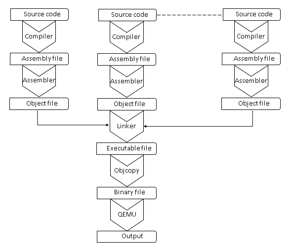

# From C Programs to Assembly Code

In the previous chapter we learnt the syntax of the C programming language and practiced writing a few programs in C. As mentioned earlier the CPU understands instructions that are part of its ISA. Programs may be written in assembly language and a special application called an *Assembler* converts assembly code into binary format that can be read and executed by the processor.

So how does code written in C get executed by the processor? The C code is translated into assembly and that resulting assembly is then converted into a binary file which is executed on the processor. This is done by a combination of three applications - compiler, assembler, and linker. 

The *compiler* translates code from a high-level language, like C, to assembly. The *assembler* then converts the assembly code to a binary format. In this chapter we will see what assembly code is generated by the compiler for some common code fragments in C. We will also learn how to disassemble binary files back to assembly code. But first, let us start by understanding the tools used for compilation and disassembly.

## Tools to compile and disassemble

In the previous chapters, we were using an utility called **make** to compile our programs. In all the exercises, running *make* in the directory with the code would automatically call the compiler or assembler as required. This was useful because *make* is a short command and it saves us the trouble of repeatedly typing the longer command to invoke the compiler/assembler.

What is actually executed when we *make* is specified in a file named **Makefile**. When the *make* command is executed, it uses the contents in this file to determine which files to compile/assemble. There is also an additional advantage in using this utility. It uses the timestamp of files to determine when they were last updated and selectively compiles only those files that have changed since the last invocation of *make*. At every invocation of the *make*, only the files that were changed after previous compilation would be compiled. 


### Overview

Let us first take a step back and see what is involved in compiling a C source code into an executable file. The figure below shows the process of converting a C program file to a binary file that can be executed by the QEMU simulator.



Large programs can have multiple code files and those files can be a combination of C (or other high-level languages) and assembly. First, the C file is processed by an application called the *compiler* which translates the C program to assembly. For this book we use a free and open-source compiler called GCC. The specific version that we use translates C programs to ARM assembly. The generated assembly is further translated by an assembler into a binary format called an *object file*. GCC does both translations and so we do not see the intermediate assembly file. It is possible to make the compiler stop after generating the assembly files. We will see how to do this later.

The object files could have references to functions in other object files. For example, in the programming exercises in previous chapters we used a function `uart_puts()` to print characters. However, this function is not present in the file where the function is called. Instead, we include  *uart.h* to tell the compiler that (1) a function named `uart_puts()` exists and (2) it maybe in a different file that also has to be compiled. The code for `uart_puts()` is in a *exercises/common/uart.c*.  Since the function is in a different file, the compiler does not know what program  address to branch to when calling that function.

So GCC, when generating the object file, leaves a label (i.e. a placeholder) for the target of the branch instruction. After creating all the object files - one for each program file - we use a *linker* to combine them together and create one final ELF executable file. 
The linker takes one or more object files and a **linker configuration file** and generates an ELF executable. In doing so, it also resolves references to external symbols (such as *uart_puts*) and assigns final addresses to functions and variables. The output of the linker is in **ELF** file format.

ELF stands for **Executable and Linking Format** and it is a file format used for  binary executables. This file is organized into **sections**. Each section can hold executable code, data, debugging data, symbol tables, relocation information etc.

On a computer that is running an operating system an ELF file will be sufficient to run the program. When we execute the ELF file on such a system, yet another application called the *loader* reads the sections in the ELF file and loads them into memory. The addresses at which to load each section is provided in the ELF file.

However, in this book we are running our code "bare metal", meaning there is no operating system (and so no loader either!!) that can help with running our program.  Therefore, we need to convert the ELF executable to a simple plain binary file format that can be executed bare-metal by QEMU simulator. This is accomplished by the **objcopy** step in the above diagram. Finally, we have a file that the QEMU simulator can execute and produce an output.
 

### Compiling Hello World

We use **ARM GNU Toolchain**  which contains the GNU C/C++ Compiler (GCC), Assembler, Linker and various utilities (referred to as binutils). The compiler that we use to compile our C files is: **aarch64-none-elf-gcc**.
Let us now start with the Hello World  example that we used in the **Programming in C** section and understand how the above steps are performed. Here is the code:

```c
#include "uart.h"
void main() {
  uart_puts("Hello World");
}
```

Readers can follow along by executing the commands specified in this section. The directory to work in is at:

```
exercises/c_functions/hello_world_example.c
```

The first line of the above code starts with "#include" directive.  This directive tells the preprocessor (which is the first pass of the compiler) to insert the contents of another file into the source code at the point where the #include directive is found. Include directives are typically used to include the C header files for C functions that are held outside of the current source file. We use it in our program to make use of the `uart_puts()` function declared within **uart.h** file. The **uart.h** file is located at the *exercises/include/* directory. 

**Step 1: Use this command to compile the above hello_world_example.c file:**

```
aarch64-none-elf-gcc -ffreestanding -g -nostdinc -nostdlib -nostartfiles -I../include/ \
-c hello_world_example.c -o hello_world_example.o
```

To compile our code we use the compiler **aarch64-none-elf-gcc** followed by a series of options and a list of files to be compiled. 

```aarch64-none-elf-gcc <list of options> <list of files>``` 

Options are used to control the behaviour of the compiler and all of them start with a hyphen followed by one or more alphanumeric characters. While aarch64-none-elf-gcc supports many of them, only few options will be needed by us. If you are curious to learn about all of the options you can run the command below to list them all: 

```aarch64-none-elf-gcc -v --help```

The following table provides details and purpose of the options used by the above command line.

| Compiler Option | Description |
| ----------- | --------- |
| -o &lt;file&gt; | Place the output in &lt;file&gt;. This will be the name and path of generated object files |
| -I &lt;dir&gt; |  Add &lt;dir&gt; to the to list of directories to be searched for include files |
| -c | Compile and assemble the C file, but do not link |
| -ffreestanding  | Indicate that the file should be compiled for a freestanding, not a hosted, environment. A freestanding environment is one in which the standard library may not exist, and program startup may not be at symbol "main" | 
| -g | Generate debug information in generated object files |
| -nostdinc | Do not search the standard system directories or builtin directories for include files |        
| -nostdlib | Do not link with standard C libraries |
| -nostartfiles | Do not use the standard system startup files when linking |

This command produces object file hello_world_example.o. The option **-ffreestanding** is used to specify that the code would be run directly on hardware and there is no underlying operating system support. 
As there is no operating system support, the application will have to be self-contained.  We need to provide all the suporting code ourselves and cannot rely on standard C libraries and include files. We use the options **-nostdinc -nostdlib -nostartfiles** to tell the compiler not to make use of any standard include files, libraries or start files.  

The step above has created the **object file** hello_world.o. Now the GNU linker can be used to create the **executable file** from object files created by compiler. The GNU linker can be invoked using command **aarch64-none-elf-ld**. 

**Step 2: Use this command to generate hello_world_example.elf file using the hello_world_example.o object file that we produced using step 1:**

``` aarch64-none-elf-ld -nostdlib -nostartfiles -T link.ld -o hello_world_example.elf start.o hello_world_example.o ../common/uart.o ```

The usage syntax of **aarch64-none-elf-ld** is similar to **aarch64-none-elf-gcc**.  

```aarch64-none-elf-ld <list of options> <list of object files> ```

The **-nostdlib -nostartfiles** options tell the linker not to link with standard C library or use standard start files while producing the executable. A linker script **link.ld** is passed to exercise greater control over the linking process. As you can notice in the above command, we use two more object files **start.o** and **uart.o** in the above command to produce the final executable. File **start.o** contains the code to boot the CPU and hand over the control to **main** function. The boot process involved initialization and configuration of various system registers, general purpose registers and memory. We will explain more about the boot process in a Part-2 of this book.

We run the generated executable using a free and open-source emulator named [QEMU](https://www.qemu.org/download). It can emulate a set of different hardware and device models. As QEMU requires the file to be executed in binary file format, we convert the ELF file to binary file using **aarch64-none-elf-objcopy** utility by running following command: 

**Step 3: Use this command to convert the ELF file to binary file:**

```aarch64-none-elf-objcopy -O binary hello_world_example.elf kernel8.img```

The above command will produce a binary image named kernel.img. 

**Step 4: Use this command to run kernel.img file using QEMU:**

```qemu-system-aarch64 -M raspi3 -kernel kernel8.img -serial null -serial stdio -nographic```

### Disassembly

Disassembly is the process of converting a binary file - typically an ELF file - back to assembly. Let us now see how we can translate the ELF executable back into assembly format using an utility called disassembler. **aarch64-none-elf-objdump** utility provided as part of *binutils* in the GNU toolchain can be used to disassemble the object file or ELF executable.

**Step 5: Use this command to disassemble the object file:**

```
aarch64-none-elf-objdump -D hello_world_example.o > hello_world_example.disass
```

The -D option is used here to specify that all the code and data sections from hello_world_example.o should be disassembled.

Disassembly will produce output for multiple sections. We will look at it section by section.

**Disassembly of the code section:**

The .text section contains the instruction opcodes produced by the compiler for the C function. The disassembly output produced for the .text(code) section by the above command is shown below:


```
hello_world_example.o:     file format elf64-littleaarch64


Disassembly of section .text:

0000000000000000 <main>:
   0:	a9bf7bfd 	stp	x29, x30, [sp, #-16]!
   4:	910003fd 	mov	x29, sp
   8:	90000000 	adrp	x0, 0 <main>
   c:	91000000 	add	x0, x0, #0x0
  10:	94000000 	bl	0 <uart_puts>
  14:	d503201f 	nop
  18:	a8c17bfd 	ldp	x29, x30, [sp], #16
  1c:	d65f03c0 	ret
```

The first column in the disassembly output displays the address of each opcode in the section. The second column displays the machine code for the instruction. The third column displays the assembly instruction. As an example, let us consider this line:
```
   c:	91000000 	add	x0, x0, #0x0
```
Here, the assembly instruction is **add	x0, x0, #0x0**. It machine code is: **0x91000000**. The address where this machine code would be placed  in memory is 0xc. However, this is a temporary address provided just for the object file. The final address will be decided later when all object files are merged together into an *elf* executable. Note that the address of each instruction is 4 bytes after the previous one. This is because each instruction is 4 bytes long. 

In our *hello_world_example.c* we have a function with the name main. The text *\<main\>* in the code section indicates that this is the disassembly of the function named *main*. To the left of the function name is a long chain of 0s. This is meant to be the address of the function - i.e. the location that this function will be placed in memory. However, the final address of code (and therefore functions) and data is determined when we link all the object files into an *elf* file. In the object file we have only example addresses that always start at 0x0 (for both code and data sections).

The first instruction `stp	x29, x30, [sp, #-16]!` stores a pair of registers x29 and x30 into the stack. The next instruction copies the stack pointer to x29. Why does that need to be done? From the earlier assembly program examples we know that functions have to save values of the registers that they plan to overwrite. Because any previous function that called the current one may be storing data in those registers and we do not want to *clobber* the values. For small assembly programs that are written by one programmer we can make up ad-hoc rules on what registers are to be saved. But in the real world, code written one programmer is reused by others. It is quite common for a programmer to write library code that will be distributed as binary files and other programmers will call functions in this library from their own code. 

The ARM architecture has an associated document called the ARM Procedure Call Standard (PCS). It defines, among other things, who should save register values - the calling function (caller) or the called function (callee). As per the PCS registers X29 (frame pointer) and X30 (link register) are special registers that must be saved by the callee. Any function that intends to call another must save X30. 

Function *main* will overwrite both X29 and X30. As can be seen from the disassembly-  
- The second instruction copies the stack pointer (SP) into X29.
- We make a call to *uart_puts* function - this is done using the `bl` instruction. That call will overwrite X30.  

Since X29 and X30 are going to be overwritten in *main* the compiler saves them on the stack and restores them at the end of the function. Note that the register X29 in AArch64 is used as a *frame pointer*. For now it is not necessary to know more about the FP so we will save that explanation for later.


**Disassembly of the data section:**

The .rodata section contains the Read-only data produced by the compiler for the **Hello World** string referred by the C function. The disassembly output produced for the .rodata section is shown below:

```
Disassembly of section .rodata:

0000000000000000 <.rodata>:
   0:	6c6c6548 	ldnp	d8, d25, [x10, #-320]
   4:	6f57206f 	umlal2	v15.4s, v3.8h, v7.h[1]
   8:	00646c72 	.inst	0x00646c72 ; undefined
```

The data section also looks like the code section. Though there is no code in this section of the file,  the disassembler still disassembles it as though it is code. However, be assured that this section will not get executed. We can ignore the last column with instruction mnemonics. What is of interest is the second column. The second column is the data that will be stored in memory. Each line in this column shows 4 bytes of data. Also, that byte is printed in **reverse order**. So to get the correct data one has to read the second column from right to left. For example, 6c6c6548 in the disassembly above, should be interpreted in following order: 48, 65, 6c, 6c. In general, disassembly of any data section will have to be interpreted in the reverse order.

The string **Hello World** that we used in our program is stored in the data section.
The column below shows the data values and the corresponding ASCII character of that data value.

| ASCII Value | Character |
| ----------- | --------- |
|     48      |     H     |
|     65      |     e     |
|     6c      |     l     |
|     6c      |     l     |
|     6f      |     o     |
|     20      |   space   |
|     57      |     W     |
|     6f      |     o     |
|     72      |     r     |
|     6c      |     l     |
|     64      |     d     |
|     00      |   null    |

The first four bytes of this string are 48 65 6c 6c. When reversed it becomes 6c 6c 65 48. This corresponds to the first four bytes of the .data section disassembly. 

**Disassembling the elf file:**

We can also choose to disassemble the ELF executable instead of the object file. This would produce the disassembly of startup file(start.o) and library file(uart.o) as well. As this disassembly output would be very long, small snippets of disassembly from various sections are shown below. The main point of interest here is that now all the memory addresses are finally set to the values they will be loaded at when the program executes.

```
hello_world_example.elf:     file format elf64-littleaarch64


Disassembly of section .text:

0000000000080000 <_start>:
   80000:       d53800a1        mrs     x1, mpidr_el1
   80004:       92400421        and     x1, x1, #0x3
   80008:       b4000061        cbz     x1, 80014 <_start+0x14>
   8000c:       d503205f        wfe
   80010:       17ffffff        b       8000c <_start+0xc>
   80014:       580001a1        ldr     x1, 80048 <_start+0x48>
   80018:       9100003f        mov     sp, x1
   8001c:       580001a1        ldr     x1, 80050 <_start+0x50>
   80020:       18000102        ldr     w2, 80040 <_start+0x40>
   80024:       340000a2        cbz     w2, 80038 <_start+0x38>
   80028:       f800843f        str     xzr, [x1], #8
   8002c:       51000442        sub     w2, w2, #0x1
   80030:       35ffffa2        cbnz    w2, 80024 <_start+0x24>
   80034:       94000013        bl      80080 <uart_init>
   80038:       94000008        bl      80058 <main>
   8003c:       17fffff4        b       8000c <_start+0xc>
        ...


0000000000080058 <main>:
   80058:       a9bf7bfd        stp     x29, x30, [sp, #-16]!
   8005c:       910003fd        mov     x29, sp
   80060:       90000000        adrp    x0, 80000 <_start>
   80064:       9114c000        add     x0, x0, #0x530
   80068:       94000057        bl      801c4 <uart_puts>
   8006c:       d503201f        nop
   80070:       a8c17bfd        ldp     x29, x30, [sp], #16
   80074:       d65f03c0        ret
        ...


0000000000080080 <uart_init>:
   80080:       d28a0081        mov     x1, #0x5004                     // #20484
   80084:       d28a0c07        mov     x7, #0x5060                     // #20576
   80088:       f2a7e421        movk    x1, #0x3f21, lsl #16
   8008c:       f2a7e427        movk    x7, #0x3f21, lsl #16
   80090:       d28a0984        mov     x4, #0x504c                     // #20556
   80094:       d28a0a05        mov     x5, #0x5050                     // #20560
   80098:       b9400020        ldr     w0, [x1]
   8009c:       f2a7e424        movk    x4, #0x3f21, lsl #16
   800a0:       f2a7e425        movk    x5, #0x3f21, lsl #16
        ...

00000000000801c4 <uart_puts>:
   801c4:   39400001    ldrb    w1, [x0]
   801c8:   34000201    cbz w1, 80208 <uart_puts+0x44>
   801cc:   d28a0a82    mov x2, #0x5054                 // #20564
   801d0:   d28a0804    mov x4, #0x5040                 // #20544
   801d4:   f2a7e422    movk    x2, #0x3f21, lsl #16
   801d8:   f2a7e424    movk    x4, #0x3f21, lsl #16
        ...

Disassembly of section .rodata:

0000000000080530 <.rodata>:
   80530:       6c6c6548        ldnp    d8, d25, [x10, #-320]
   80534:       6f57206f        umlal2  v15.4s, v3.8h, v7.h[1]
   80538:       00646c72        .inst   0x00646c72 ; undefined
        ...
```


## What we learnt this chapter

- How C and assembly programs are compiled to ELF files
- The ELF file is concerted to a binary file that can be used to run bare-metal
- How to disassemble an ELF or object file 