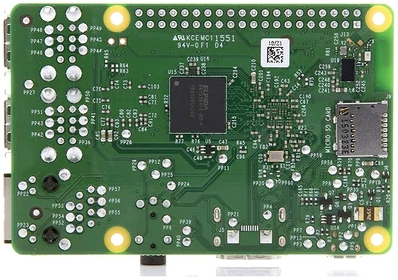

# Computer System Overview

This section gives an overview of the main components of a computer system. It is not a comprehensive explanation of everything on a computer board. The intention is to provide readers with sufficient context to understand the rest of this book.

The components in a computer system are mounted on a board and connected to each other by wires embedded in the board. These components include a system on chip (SoC), peripherals and connectors. The SoC is the component that performs computation. Everything else on the board is to enable the SoC to perform its work and for the external world (including human users) to interact with the SoC. This is a general description of a computer system. Every individual system will have some differences. The peripherals on the board may be different. Also, some systems may have high-speed interconnects such as PCI that allows extension cards to be connected to the system.

In part one of this book we will be working with a **software model** of the popular single board computer -  
[Raspberry Pi](https://www.raspberrypi.org/). The image below shows a Raspberry Pi 3 B+ model single-board computer. The big silver coloured square chip with text on it is the SoC.

<!--

-->

<!-- Write your comments here -->

The [SoC used in this board](https://www.raspberrypi.com/documentation/computers/processors.html) is designed by Broadcom. There are multiple ARM CPUs inside the SoC to perform computations. In addition to the CPUs there are other components such as a graphics chip, memory etc in the SoC.

The CPUs (also called cores) are based on the ARM AArch64 architecture specification. We will be learning AArch64 assembly language that can be used to write programs to direct what the CPU should do - i.e. the specific steps they need to perform for things like computing the fibonacci series etc.

Besides the main SoC there are other components on the chip. The black square with the text "LAN 7515" is another micro-chip which is a USB hub and a controller for Ethernet. In addition to these chips there are USB ports, a micro USB port, an ethernet port and GPIO pins on the board.

Here is a picture of the back of the board. The black square that is aligned with the SoC on the top of the board is the DRAM (memory) that the processor uses to store data. 

The main item of interest for us are the ARM cores inside the SoC. Almost all of the material in this book will be about how to write code that can be executed by these cores. The SD-card slot where a storage card can be affixed is the silver rectangle on the right side.

<!--
## The System On a Chip

-->

## The SoC

The picture below shows a block diagram of the components inside a typical SoC. 

In the top left of the diagram is the CPU with multiple cores. The CPU is the main computation engine inside the SoC. Many modern CPUs are multi-processors, meaning they have more than one processing core in the CPU. Each CPU has a L1 cache. Caches are fast SRAM memory of limited capacity that the CPU can access quickly. Data that is frequently used by the CPU is stored in caches so that it can be accessed faster than from DRAM.

The cores share some of the components on the CPU and SoC. Usually they will share the level-2 cache, level-3 cache (if any), interconnect, memory, and I/O peripherals. The SoCs in Raspberry Pi 3 boards have quad-core ARM Cortex A53 CPUs. Each core has a 32KB L1 data cache and a 48KB L1 instruction cache. The cores share a 1MB L2 cache.

All cores in the CPU share a main memory unit (MMU). This unit is used to translate *virtual addresses* used by the CPUs to *physical addresses*. Virtual and physical addresses will be covered in part two of this book. The CPU connects to memory and peripherals - such as ethernet, DMA, USB, timer, UART, SPI, I2C,  I2S, PWM etc. - via the interconnect which is labeled as AMBA/AXI in the diagram.

## The ARM Cores

The CPU cores are the components that perform computation. The cores are programmable, meaning that they understand a set of instructions and the programmer can write programs by issuing instructions from this set to the *Core*. These CPUs conform to the ARM Cortex-A architecture. The architecture defines the instructions and their encoding, resources available to the *Cores*, and some other features like how memory is addressed etc.

The picture below shows a high-level block diagram of the inside of a typical CPU core. The CPU consists of an execution pipeline comprising
- Program counter: Tracks the current instruction being executed
- logic gates to fetch instructions, decode them, execute and write results
- caches and registers to store results
- memory structures to store in-flight instructions, data, meta-data (for branch prediction, pre-fetching etc.)

How do the cores execute the programmer's commands? 

Well, the programmer writes the program in assembly language or a higher level language like C. The program is compiled into a binary file using a compiler. The binary file is an encoding of the instructions (as specified in the architecture manual). This file is loaded into *memory* and the *program counter* (PC) of the CPU core is set to the memory address of the first instruction in memory. Multi-processor SoCs have multiple programmable CPU cores. Each of them have their own program counter. They can execute code independent of each other.

The logic blocks of the CPU then read the instruction from memory (*instruction fetch*) location pointed to by the PC, decode it, read the required data for the operation, perform the operation (*execute*) and write results back to registers or to memory (store instructions).

Note that the *fetch stage* of the processor works automatically to load instructions from memory into the processor pipeline. No explicit program instruction is needed for this purpose. However, to move **data** to/from memory from/to *registers* the programmer has to use load and store instructions. Instructions that perform computations read their input values from registers in the *register file* (i.e. collection of registers) and write the output back to the register file. 

The register file is a small memory structure, comprising multiple registers, that is close to the processor pipeline. It is used to store values required for instructions executing in the processor. Since it is closest to the processing core, it can be accessed quickly. Typically registers in the register file can be read/written in one CPU cycle. However, due to area and latency constraints the number of registers available is usually small. Therefore, for most programs the entire data needed to be read/written by the program cannot be stored in the register file. ARM is a RISC architecture. So compute instructions cannot directly use data located in memory. Nor can they write results directly back to memory. In this architecture, programmers have to explicitly load data from memory into a register and then use it to compute values. There are separate instructions - distinct from computational ones - to load and store data from memory.

## Bits and Bytes

As most readers probably know, computers store and process data as *bits*. A single bit - binary digit - is the minimum unit of information stored in a computer. A bit can hold one of two values - 0 or 1. A group of 8 bits, called *byte*, is usually the smallest addressable unit of memory. In a modern computer system (most of them anyway) memory in a computer consists of a millions of bits that are grouped into bytes. Every byte has a unique address and can be individually loaded into registers using specific instructions. A byte is 8-bits. A *word* is 4 bytes. A *double-word* is 8 bytes and a *half-word* is 2 bytes. These are the data sizes one will commonly encounter in assembly programming.

In Part 1 you will learn how to write programs that run on the ARM Cores. In the process we will learn the ARM A-class processor architecture, ARM assembly, and some C programming.
