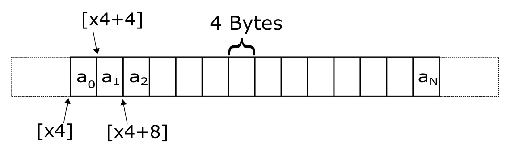
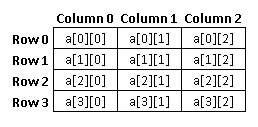
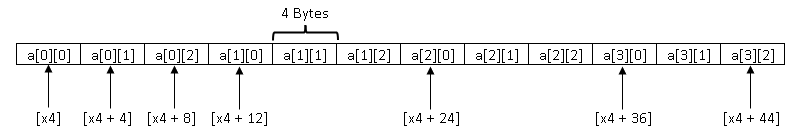
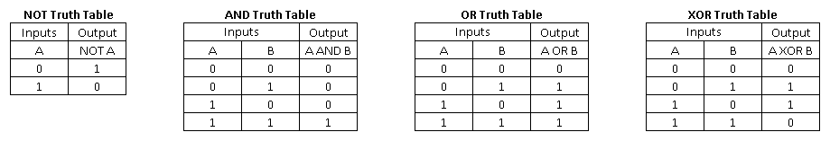
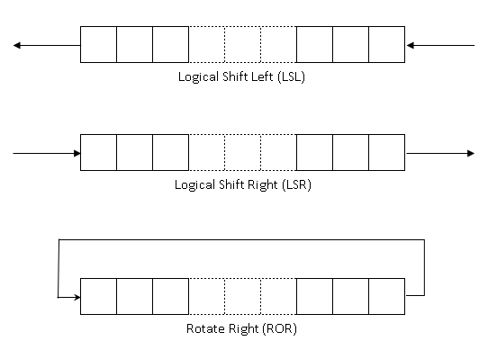
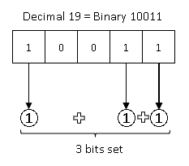

# Integer Instructions

We have already used two arithmetic instructions - **add** and **cmp** - in the previous section. In this section we introduce a few more commonly used integer instructions. Like earlier, we will do this through a series of assembly programs. For some of the programs we have provided the explanation in pseudo code only. This is an opportunity for you to write the assembly program by yourself.

## Sum of numbers in an array

In this exercise we will add a set of numbers in a loop. We will also learn a new memory addressing method in the bargain.

In computer programming, arrays are data structures that consist of the same type of data stored in contiguous locations of memory. Examples of the type of data includes 8-bit integers, 16-bit integers, 32-bit integers etc. ASCII strings are arrays of 8-bit integers that have a special value that indicates the end of string. Arrays of other types do not have any end markers like strings. Therefore, the programmer should know the number of elements stored in the array so that they do not overshoot the array and access memory locations outside of it.




The figure above shows how the elements of an array appear in memory. In this example, each element is 4 bytes large. The start address of the array is in x4. Since the array elements are 4-bytes large, the address of the second element is [x4 + 4] and the one after that [x4 + 8] and so on. This array has N+1 elements and the address of the last element is [x4 + N]. Here N is just an example to show arrays can be of any length.

Arrays are a convenient way to store a list of the same type of object. When an operation is to be performed on all elements of a array it is typically done in a loop. Programmers can easily read/write to each item in the list by using the register + offset, pre-indexed, or post-indexed modes of addressing.

One common programming error is to access memory beyond the end of an array. The dotted region in the figure represents memory that is outside the array. Programmer should be careful to only access memory locations that are part of the program. Accessing memory outside the locations representing the program's data may not cause the program to crash always. But it is an error and can cause crashes that are difficult to debug.

We will now look at a program that has 32-bit integers stored in an array. The program will add all the integers in the array and print their sum. Our program is organized as follows:
- The address of the first element of the array is stored in the register x4
- The register w1 stores the number of elements in the array
- The sum of the elements is stored in w0

The address of the first element of the array is stored in the register x4. We will use the register x2 as the index for different values of the array. The relevant portion of the program is given below. The reader can try it out by typing this code in the file integer_instructions/sum.s

To compile and run:
```
DIRECTORY: exercises/integer_instructions/
COMPILE_COMMAND: make sum.elf
RUN_COMMAND: make run
```

The program code:

```armasm
   // Your code starts here
    mov    x4, x0

   // Initialize sum to 0.
    mov    w0, 0

   // Iterate over elements of the array and add the value to result

   // Initialize index to 0. This register will hold the value of current element number
   mov    x2, 0
loop:
    // Load the value at current index
    ldr    w3, [x4, x2, lsl 2]

    // Add the value to sum
    add    w0, w0, w3

    // Increment the index
    add    x2, x2, 1

    // Check if we have iterated through all the elements of the array
    cmp    w1, w2

    // Branch back to beginning of loop if there are more elements
    bgt    loop

    // Your code ends here
```

One can add comments in the code by starting the line with the text "//". Everything following in that line will be ignored when the program is assembled/compiled. In this program the explanation for every instruction is provided as comments. The load instruction uses register + offset mode that we learnt in the section on Memory Instructions. This addressing mode allows the programmer to provide an optional operation that is to be performed on the offset register.

>ldr    w3, [x4, x2, lsl 2]

To compute the address of the load, the offset register (x2) is left shifted by 2 and added to the x4 register.

> x4 + (x2 << 2)

Why do we left shift by 2? Every element in this array is 4 bytes large. The address of each element is offset from the base by the element's index number times 4. For example, for the 4th element in the array the offset from the beginning of the array is 3 * 4 = 12 bytes. Remember that the first element of the array is at the 0th index and the fourth element is at index 3.

We track the index of the current element in register w2 and therefore we multiply that number by 4 to get the memory address offset. As we saw in the binary arithmetic section, multiplying by 4 is the same as left shifting by 2.

---

**Extend operators in register+offset addressing:**

We used the LSL extend operator in this example. The register+offset addressing method has three other extend operators. These are:

- UXTW
- SXTW
- SXTX

Refer to the ARM Architecture Manual to learn more about them.

---


## Finding the maximum number in an array

Here is a challenge for you. Write a program to find the maximum number in a given array of numbers. The file *exercises/integer_instructions/find_max.s* has the data set up and comments indicating where your code should be placed. Here is the information you need to write this program:
- The address of the first element in the array is stored in x0
- The number of elements is in the array is in x1
- The size of each element in the array is 1 word (4 bytes)
- Store the number

The program can be written in multiple ways. It does not matter if your version is not identical to the solution as long as it finds the correct answer.

**csel** is a new instruction that can be used as part of this exercise. This instruction checks the condition set by the previous instruction (could be a cmp instruction) and if the condition is true it copies the value of Wn to Wd. If the condition is false it copies the value in Wm to Wd.
```armasm
 csel <Wd>, <Wn>, <Wm>, <cond>
```
The condition in the cond field can be one of the following (from [ARM ARM](https://developer.arm.com/documentation/ddi0487/ga) C.1.2.4 Condition Code) :

| Mnemonic | Meaning (integer)| Condition Flags |
| ------ | ------ | ------ |
| eq | Equal | Z == 1|
| ne | Not Equal | Z == 0 |
| cs or hs | Carry Set | C == 1 |
| cc or lo | Carry clear | C == 0 |
| mi | Minus, negative | N == 1 |
| pl | Plus, positive or zero | N == 0 |
| vs | Overflow | V == 1 |
| vc | No Overflow | V == 0 |
| hi | Unsigned higher | C == 1 && Z == 0 |
| ls | Unsigned lower or same | !(C == 1 && Z == 0) |
| ge | Signed greater than or equal | N == V |
| lt | Signed less than | N != V |
| gt | Signed greater than | Z == 0 && N == V |
| le | Signed lessthan or equal | !(Z == 0 && N == V) |


For example, the following instruction compares the values in 20 and w3 and copies the value in w3 to w0 if the condition specified is satisfied

> csel w0, w0, w3, ge


If the value in w3 is greater than that in w0 then contents of w3 are copied to w0.

You can use the csel instruction in your program if you choose to. A solution without the instruction is also perfectly fine. Once you are done you can take a look at the code below (or in *exercises/integer_instructions/find_max_solution.s*).


<details>
  <summary>Click to see the solution after you solve the problem</summary>

```armasm
    // Your code starts here
    mov    x4, x0

    // Initialize current maximum value with first element of array
    ldr    w0, [x0]

    // Check if there is only one element in the array
    cmp    w1, 1

    // Branch to done label if there is only one element
    beq    done

    // Set index to element 1
    mov    x2, 1

    // Iterate over array elements from index 2 and with current max
loop:
    ldr    w3, [x4, x2, lsl 2]

    // Compare the value against current maximum
    cmp    w0, w3

    // Select the new value if it is greater than current maximum
    csel    w0, w0, w3, ge

    // Increment the index
    add    x2, x2, 1

    // Check if we have iterated through all the elements of the array
    cmp    w1, w2

    // Branch back to beginning of loop if there are more elements
    bgt    loop
done:
    // Your code ends here
```  
</details>


## Counting leading zeroes

In this exercise we will count the leading number of zeros in a given number. Leading zeroes are those that occur before the first 1 is encountered in the number when reading it left to right. For example, the number 0010_1011 has two leading zeroes.

For this exercise use the file *exercises/integer_instructions/clz.s*. We also introduce two new instructions - tbz and tbnz. In clz.s we have placed the number -  for which leading zeroes have to be found - in register w0. We will count the number of leading 0s in the given number and place the result in w0. The print function that is called later (already included in clz.s, you do not need to add it) will print the value stored in w0.

The code to find the number of leading zeroes is below. Try typing it out into the file and getting it working.

To compile and run:
```
DIRECTORY: exercises/integer_instructions/
COMPILE_COMMAND: make clz.elf
RUN_COMMAND: make run
```

```armasm
    // Your code starts here
    mov    w1, w0 //copy the number to w1

    // Initialize count to 0; we will use w0
    mov    w0, 0

    // Test if bit 31 of value is 1. If it is 1, branch to label 'done'
    tbnz    w1, #31, done

    // Keep left shifting the value by one until leftmost bit does not become 1
loop:
    // Left shift the value by 1
    lsl    w1, w1, 1

    // Increment the count by 1
    add    w0, w0, 1

    // Test if bit 31 is 1. If it is not 1, branch back to label 'loop'
    tbz    w1, #31, loop
done:
    // Your code ends here
```

The comments in the program should give enough information about how the code works. But there are a few new instructions that we will will go over.

Most of the instructions in the program should be familiar by now except **tbz**, **tbnz** and **lsl**. The **lsl** instruction takes three arguments, the destination register, the source register and a shift value. The instruction shifts the source register left by the specified amount and stores the result into the destination.  

> lsl w1, w1, 1

The above instruction shifts the value in w1 left by 1 and saves the result in w1. There is a variant of **lsl** where the shift value can be specified in a register. You will find the syntax for the instruction in ARM ARM.

The tbnz is a branch instruction that tests if the specified **bit**  in a given register is **not zero**. If the test result is true it branches to the label provided by the user. The **tbz** instruction checks if the bit is zero. If true it branches to the specified label.

## Computing the Factorial of a number

In this exercise we will compute the factorial of a number. Factorial value of a number 'N' is multiplication of all integers smaller than or equal to 'N'.

Mathematically it is written as:

```
n! = 1 * 2 * 3 * 4 * ... * (n-1) * n
```

For example, factorial of 5 is:

```
5 * 4 * 3 * 2 * 1 = 120
```

For this exercise use the file *exercises/integer_instructions/factorial.s*. In factorial.s we have placed - the number for which factorial will have to be computed - in register w0. We will compute the factorial and place the result in w0. The print function that is called later will print the value stored in w0.

We will first introduce the multiply instructions. There are multiply instructions that operate on 32-bit or 64-bit values and return a result of the same size as the operands. For example, two 64-bit registers can be multiplied to produce a 64-bit result with the MUL instruction.

```
MUL <Wd>, <Wn>, <Wm>  // 32-bit variant
MUL <Xd>, <Xn>, <Xm>  // 64-bit variant
```

These instructions multiply the values in Wn(or Xn) and Wm(or Xm) and places the result in Wd(or Xd)  

For example:
```
MUL W0, W1, W2 // W0 = W1 * W2
```

Additionally, there are also multiply instructions that produce a long result, that is, multiplying two 32-bit numbers and generating a 64-bit result. There are both signed and unsigned variants of these long multiplies (UMULL, SMULL).

```
UMULL <Xd>, <Wn>, <Wm>  // Unsigned multiply long
SMULL <Xd>, <Wn>, <Wm>  // Signed multiply long
```

Below is pseudo code to compute the factorial. You can use this as a guide to write the assembly code.

1. Use one register (say w0) to store the computed factorial(product) and initialize it with 1
2. Use one register (say w1) to increment the values from 2 to N-1 using a loop
3. Multiply current number in w1 with the product in w0 in each iteration of the loop

To compile and run:
```
DIRECTORY: exercises/integer_instructions/
COMPILE_COMMAND: make factorial.elf
RUN_COMMAND: make run
```

<details>
  <summary>The solution to this exercise is below (also in exercises/integer_instructions/factorial_solution.s)</summary>

```armasm
    // Your code starts here
    add    w2, w0, 1

    // Initialize w0 to 1.
    mov    w0, 1

    // Initialize w0 to 2.
    mov    w1, 2

    // Multiply numbers from 2 to N-1 with w0 using a loop
loop:
    // Multiply current number in w1 with the product in w0
    mul    w0, w0, w1

    // Increment the value in w1 by 1
    add    w1, w1, 1

    // Compare w1 and w2 to check if they are equal
    cmp    w2, w1

    // Branch back to label 'loop' if w1 is not equal to w2
    bne    loop

    // Your code ends here
```
</details>


## Matrix subtraction and addition

An array of arrays is known as two dimensional (2D) array or matrix. A matrix can be represented as a table of rows and columns. Data in 2D arrays are stored in tabular form. Elements in two-dimensional arrays are commonly referred to by a[i][j] where 'i' is the row number and 'j' is the column number and 'a' is the 2D array.

A two dimensional array can be seen as a table with 'M' rows and 'N' columns where the row number ranges from 0 to (M-1) and column number ranges from 0 to (N-1). A two dimensional array 'a' with 4 rows and 3 columns is shown below:



A matrix of 'M' rows and 'N' rows will have 'M * N' elements.  If a matrix has same number of rows and columns, then it is called as 'square' matrix.

The actual representation of this matrix in memory would be something like this:



In this exercise, we will take two square matrices, 'A' and 'B' as input parameters and store the result in matrix 'C'. Two matrices can be added only if they have the same dimensions. The result will be a matrix of the same dimensions. To perform the addition, numbers in matching positions in the input matrices are added and the result is placed in the same position in the output matrix. Following diagram illustrates this by adding two 2x2 matrices 'A' and 'B' and places the result in matrix 'C'.


For this exercise use the file exercises/integer_instructions/matrix_addition.s. In matrix_addition.s, the program registers are initialized as follows:

1. The start address of first square matrix to be added is in register x0
2. The start address of second square matrix to be added is in register x1
3. The start address of square matrix where the sum of matrix A and matrix B needs to be stored is in register x2
4. Register x3 holds the dimension of square matrices A, B  and C

Below is pseudo code to add two matrices. You can use this as a guide to write the assembly code.

1. Compute the total number of elements in the matrix using the register 'x3'
2. For each element in A, find the element at the same position in B (i.e. same row and column) and add the 2 values.
3. Place the result of this addition into result matrix C in the same position.

To compile and run:
```
DIRECTORY: exercises/integer_instructions/
COMPILE_COMMAND: make matrix_addition.elf
RUN_COMMAND: make run
```
The solution for this exercise is provided in matrix_addition_solution.s. We recommend that you try to write the program your self before looking at the solution.

Matrix subtraction is very similar to matrix addition. The only difference is that we will use 'Subtract' operation instead of 'Add' operation in the above algorithm. There are 3 different variants of Subtract instructions in ARM architecture.

1. Subtract (extended register)
Subtract (extended register) subtracts a sign or zero-extended register value, followed by an optional left shift
amount, from a register value, and writes the result to the destination register. The argument that is extended from
the <Rm> register can be a byte, halfword, word, or doubleword.

```
SUB <Wd|WSP>, <Wn|WSP>, <Wm>{, <extend> {#<amount>}}  // 32-bit
SUB <Xd|SP>, <Xn|SP>, <R><m>{, <extend> {#<amount>}}  // 64-bit
```

2. SUB (immediate)
Subtract (immediate) subtracts an optionally-shifted immediate value from a register value, and writes the result to
the destination register.

```
SUB <Wd|WSP>, <Wn|WSP>, #<imm>{, <shift>} // 32-bit
SUB <Xd|SP>, <Xn|SP>, #<imm>{, <shift>}   // 64-bit
```

3. Subtract (shifted register) subtracts an optionally-shifted register value from a register value, and writes the result to
the destination register.

```
SUB <Wd>, <Wn>, <Wm>{, <shift> #<amount>}
SUB <Xd>, <Xn>, <Xm>{, <shift> #<amount>}
```

For this exercise use the file exercises/integer_instructions/matrix_subtract.s.

To compile and run:
```
DIRECTORY: exercises/integer_instructions/
COMPILE_COMMAND: make matrix_subtract.elf
RUN_COMMAND: make run
```
We recommend that you try to write the program your self before looking at the solution in matrix_subtract_solution.s.

## Printing the Fibonacci series

The Fibonacci series is a sequence of numbers, where every number is sum of the preceding two numbers. The first two numbers of the series are '0' and '1'.

Fibonacci series is:
```0, 1, 1, 2, 3, 5, 8, 13, 21, 34, . . . ```

Notice that every number in this series is the sum of the preceding two numbers. The objective of this exercise, is to write code to store first N numbers of Fibonacci series in an array. The file exercises/integer_instructions/fibonacci.s has to be used for this challenge. Here is the information you need to write this program:

1. The number of elements to be stored in the array is available in x0
2. The result should be stored as an array starting at the memory address in x1

Below is a pseudo code to generate the fibonacci series. You can use this as a guide to write the assembly code.

1. Store value '0' and '1' as the first and second elements of array
2. Use a loop to store elements 2 to N of array so that each element is sum of previous two elements

To compile and run:
```
DIRECTORY: exercises/integer_instructions/
COMPILE_COMMAND: make fibonacci.elf
RUN_COMMAND: make run
```

<details>
  <summary>The solution to this exercise is below (also in exercises/integer_instructions/fibonacci_solution.s)</summary>

```armasm
    // Your code starts here

    // 0th of the series is 0
    mov    w2, #0
    str    w2, [x1]

    // 1st of the series is 1
    mov    w2, #1
    str    w2, [x1, #4]

    // Subtract the 2 values that has been initialized above from the size
    sub    w3, w0, #2

    // Increment the index
    add    x0, x1, #4

    // Determine the address of last element of array
    add    x3, x0, x3, uxtw 2

    mov    w1, #1
loop:

    // Load the previous-1 value. Previous value is already available in register w1
    ldr    w2, [x0, #-4]

    // Add the previous 2 numbers in the series
    add    w1, w1, w2

    // Increment the index
    add    x0, x0, #4

    // Store the value in array
    str    w1, [x0]

    // Check if we have stored required number of elements
    cmp    x0, x3

    // Branch back to beginning of loop if there are more elements
    bne    loop

    // Your code ends here
```
</details>


# Logic Operations

Logical instructions are the instructions which perform basic logical operations such as OR, AND, XOR, and so on. The logical operations operate on **individual bits of the register**. The instructions (except NOT) take two registers as input and write the result to an output register.

- **AND**: For every bit in the input registers set the corresponding output bit to 1, if the bits from both inputs are 1, otherwise it sets output to 0.
- **OR**: If the corresponding bits from either input is 1 the appropriate output bit is set to 1 else it is set to 0. 
- **XOR**: Set each output bit to 1, if corresponding bits from the inputs are different. If the bits from the input operands are same (i.e. both 0 or both 1), the corresponding result bit is set to 0.
- The NOT operation reverses the bits in an operand. Every bit that is a 1 in the input is set to 0 in the output and every 0 in the input is set to 1 in the output.

## Print the XOR truth table (EOR)

A truth table is used to specify the output value for each possible combination of input values. The figure below shows the truth table for NOT, AND, OR and XOR operations.



The objective of this exercise, is to print the truth table for XOR operation. For this exercise use the file exercises/integer_instructions/xor_truth_table.s.

To compile and run:
```
DIRECTORY: exercises/integer_instructions/
COMPILE_COMMAND: make xor_truth_table.elf
RUN_COMMAND: make run
```

## Multiply and divide by a power of 2 using Logical Left Shift(LSL) and Logical Right Shift(LSR) instructions

We will start by first introducing the shift instructions:
   - Logical Shift Left (LSL): The LSL instruction performs multiplication by a power of 2.
   - Logical Shift Right (LSR): The LSR instruction performs division by a power of 2.
   - Arithmetic Shift Right (ASR): The ASR instruction performs division by a power of 2, preserving the sign bit.
   - Rotate right (ROR): The ROR instruction performs a bitwise rotation, wrapping the bits rotated from the LSB into the MSB



The Logical Left Shift(LSL) and Logical Right Shift(LSR) instructions can also be used to perform multiply and divide operations:
- Multiplication with powers of 2 can be performed using left shift operator(LSL).
- Division by powers of 2 can be performed using right shift operator(LSR).

The objective of this exercise is to multiply and divide a number by a power of 2 using LSL and LSR instructions.
1. Multiply the 32-bit value in register w0 by 128 using Left Shift Operator and place the result in register w8
2. Divide  the 32-bit value in register w1 by 64 using Right Shift Operator and place the result in register w9

For this exercise use the file exercises/integer_instructions/shift_to_multiply_divide.s.

To compile and run:
```
DIRECTORY: exercises/integer_instructions/
COMPILE_COMMAND: make shift_to_multiply_divide.elf
RUN_COMMAND: make run
```

## Count the number of 1's in a register

The objective of this exercise is to count the number of 1s in the binary representation of an integer.

For example, let us consider an input value of 19. The binary representation of 19 is 10011 and has 3 set bits. Therefore, the result should be printed as 3. The figure below illustrates this.



Below is a pseudo code to count 1's in register. You can use this as a guide to write the assembly code.
1. Loop through all bits in an integer
2. Use a shift instruction to select the bit to be checked
3. Check if bit is set and increment the count if bit is set

For this exercise use the file exercises/integer_instructions/count_ones.s.

To compile and run:
```
DIRECTORY: exercises/integer_instructions/
COMPILE_COMMAND: make count_ones.elf
RUN_COMMAND: make run
```

## Count leading zeros using CLZ instruction

- Refer earlier example in integer section

Counting leading zeroes in a number is such a common requirement in programs that the ARM ISA includes a specific instruction that does the job.

> clz \<Wd\>, \<Wn\>

This instruction counts the number of leading zeroes of the number stored in Wn and places the result in Wd!! The result value is 32 if no bits are set in the source register, and zero if bit 31 is set. In this exercise let us redo the exercise using this instruction.


To compile and run:
```
DIRECTORY: exercises/integer_instructions/
COMPILE_COMMAND: make clz_inst.elf
RUN_COMMAND: make run
```

## What we learnt this chapter
   - Arrays and how they appear in memory
   - Integer instructions - ADD, SUB, TST, MUL
   - Transferring data between registers - MOV
   - Bit operations - AND, EOR, ORR, ASR, LSL, LSR, ROR

In this section we learnt a few commonly used AArch64 integer instructions. There are several more integer instructions, and also different forms of the above instructions, defined in the ISA. We leave it to the reader to look up the [ARM ARM](https://developer.arm.com/documentation/ddi0487/ga) for a comprehensive list.
