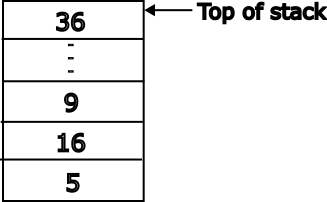
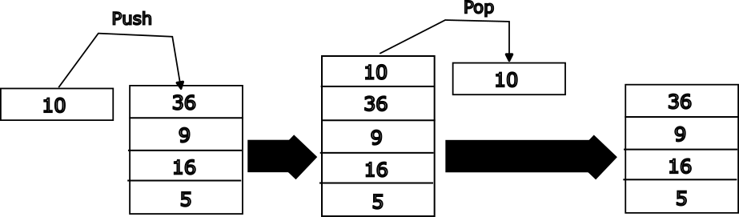

# The Stack

The stack is a data structure used in computer science. It is analogous to a stack of plates where one can add a plate to the top or remove a plate from the top but not from any arbitrary location. Below is a visual representation of a stack holding data (in this case numbers).



The figure above shows the representation of a stack that holds integers. Here the bottom-most element is the number 5. The topmost element is 36. Operations can only be performed on the top of the stack. A _push_ operation adds an element to the top of the stack. After we push 10 onto the stack it looks like the image below. New data can only be added using the push operation and that data will always be added to the top of the stack. Any number of items can be pushed onto the stack and they will all be added, one by one, to the top of the stack.



A _pop_ operation removes and returns the topmost item on the stack. Only the top item in the stack may be removed from the stack. To remove the second item on the stack one would have to remove the 1st and 2nd items (i.e. two pops).

The stack, in the context of computer architecture, is location in memory that is used to store temporary data. For example, local variables, arguments passed into functions, and arguments returned from functions. In some architectures this hardware stack operates exactly like the stack data structure. One can "push data onto the stack" and "pop data off the stack" using special instructions. In ARM AArch64 the stack is a little more flexible. Load and store instructions we saw in the [memory instructions section](./memory_inst.md) can be used to access data contained in the stack. The programmer can directly write to or read from any data contained in the stack. A special register called stack register (SP) is used to track the memory address of the top of the stack.

## Pushing and popping the stack in AArch64

By convention SP points to the last data pushed onto the stack. To push data on the stack one we can use store instructions. Here is an example of pushing two registers onto the stack.

```
stp x0, x1, [sp, #-16]!

```

The **STP** instruction is a store variant that we have not covered so far. This instruction stores a pair of registers into the memory location starting at the address computed by subtracting 16 from the contents of the **SP** register. In addition, the instruction also updates the value in **SP** to point to the new memory location that is the top-of-stack.

The other important thing to notice is that the address of the stack pointer is decremented. In AArch64 the stack grows downwards from high address to lower addresses.

When the SP register is used as the address of a load or store the address contained in the register **must be 16-byte aligned**. The address in SP must be perfectly divisible by 16. This means that the lowest 4 bits (i.e. [3:0]) of the register must be 0b000.

So if we try to push x1 and x0 onto the stack one by one, like this
```
 str x1, [sp, -#8] //stack gets mis-aligned
 str x0, [sp, #-8] //this instruction will trigger an alignment exception
```
**the code will trigger an alignment fault.** The first **str** instruction subtracts 8 from SP. Assuming that the SP was initially 16-byte aligned, after executing the first instruction it is no longer 16-byte aligned.

So when pushing onto the stack one needs to ensure that **SP** is always aligned. If the programmer, for any reason, desires to push  two registers onto the stack one by one then the first push can be used to create the space needed for all the data. Here is an example:

```
str x0, [sp, -#16]! //store x0 at sp-16 and updates sp = sp -16
str x1, [sp, #8]    //store x1 at address sp + 8. Do not change sp.

//After executing the above code the SP register will point to the
//memory location containing x0 and x1 will be at the address SP+8
```


Popping data from the stack can be done using load instructions. For example:

```
 ldp x0, x1, [SP], #16
```


## What we learnt this chapter
   1. Stack pointer in AArch64
   2. How to push and pop data
   2. Stack pointer relative load and store
