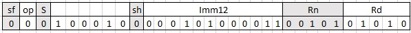

# Getting Started With ARM AArch64 Assembly

## Assembly Instruction Encoding
The ARM Architecture defines both 64- and 32-bit architectures. In this book we will focus on the 64-bit architecture which is called AArch64.

At a high level, micro-processors can be described as machines that execute a set of specifically assigned instructions. These instructions are coded/written by a programmer and are called programs (or applications, apps etc). The set of instructions that the micro-processor understands is defined in it's instruction set architecture (ISA).

Instructions are stored in memory and the microprocessor reads instruction from memory and executes them. The processor executes instructions one after another in the order specified by the programmer.

All instructions in the ISA are 32-bits long. This means that when a program compiled to execute on the ARM architecture is stored in memory, every instruction will take 8 bytes of memory. The encoding for the instructions are unique and so each instruction, such as add, subtract, multiply divide, branch etc, will have a distinct bit pattern that identifies it. The ARM architecture reference manual (ARM) lists all of the instructions available in the ARM ISA along with details of each instruction and its encoding.

For example, the encoding shown below, taken from the ARM ARM shows the encoding for an integer Add instruction. This instruction adds an immediate integer value (imm12) to the integer value stored in a selected register (Rn) and saves the result in a selected  destination register (Rd). Note that an immediate value, in this context, means that the value is encoded with the instruction.

In the figure above, notice that the bits are numbered from 0 to 31. Starting the count from 0 is quite common in computer science and engineering. 

Lets take a look at each part of the encoding. For this specific instruction, bit 31 - labeled as 'sf' - determines whether the instruction is operating on 32- bits (when sf is 0) or 64-bits of data (when sf is 1).

The twelve bits in the index range 10-21 hold the immediate value. The register numbers to use are encoded in bits 0-4 (Rd) and 5-9 (Rn). In the architecture, programmers are provided 32 general purpose registers to use. They can be encoded using 5 bits (i.e. 25 = 32). The S bit (29) indicates whether the instruction will set condition codes. Since the S bit is 0 in this encoding, it means this instruction will not set condition codes. We will discuss condition codes in more detail later in this book. 

Let us say we wish to add the value 323 to the contents of register R5 and place the results in the register R10. The encoding for that operation using an Add immediate instruction in AArch64 will look like below. 

Note that we have set sf=0 so this instruction will be a 32-bit add. We have set the 12-bits of imm12 to the value 323. The values of Rn and Rd have been set to 5 and 10 respectively. The sh bit, which we have not discussed so far, has been set to 0. In hexadecimal format this bit pattern is **0x11050CAA**.  

Clearly, it would be very difficult for programmers to write entire programs as hexadecimal digits. Thankfully that is not necessary. Programs can be written in a more convenient human-readable way using Assembly Language. The same operation can be written in assembly code as: 

>ADD W10, W0, #323

The one bit of detail we have not covered is the function of the sh bit. When this bit is set to 0 the imm12 value is zero extended. If sh is set to 1 the imm12 value is left-shifted by 12 bits and then zero extended. For now, it does not matter if you do not understand the function of the sh bit. A special application called **Assembler** is used to convert assembly programs into hexadecimal encoding.

---
**NOTE**

Zero extension is covered in the chapter on Integer Binary Arithmetic

---

Programming languages such as C, C++, Python etc allow programmers to write code at an even higher level of abstraction. Code written in high-level languages are first converted to Assembly language. This is done using an application called a **Compiler**. Once the program has been compiled another program called **Assembler** is used to convert the assembly code into instruction encoding.

## Registers

The ARM architecture provides a a number of registers that can be used by programmers for various purposes. In this chapter we will give you an overview of the portions of the architecture that are relevant to application programmers. As we cover more ground in later chapters we will gradually introduce the other portions of AArch64.

Instructions in microprocessors operate on data that is stored in memory. However, ARM is a RISC architecture. This means that the instructions do not directly perform computation on **data in memory**. The data has to be first loaded into one of 31 general purpose registers in the processor. These registers can hold either 64-bit or 32-bit data. When accessed as 64-bit values the registers are named X0-X30 (counting from 0 remember, so 31 registers). When accessed as 32-bit values the registers are names W0-W30. 

These registers are called "general purpose" because they can be used by the programmer to store any data he/she desires. The X30 register alone, by convention, is also used as a procedure call link register. This register is used to specify the address the processor should return to after completing a function. We will discuss how to use this register and the BL instruction in the section on Function Calls.

It is important to note that the 32-bit and the 64-bit register names are labels to access the same set of registers. The 32-bit names access the lower 32 bits (i.e. 0-31) and the 64-bit names access all the register bits (0-63).

Like the general purpose registers, which can be used by integer and memory instructions, there is another set of **32** registers that can be used with SIMD and floating-point instructions. These registers are named V0-V31. We will not cover SIMD instructions and therefore we will not be using those registers.

In addition to the above, programmers have access to the stack register (SP). The lower 32-bits of this register can be accessed using the name WSP. The stack register holds the memory address of the current *stack pointer*. The Stack is a special area in memory and will be discussed in detail in later sections.

Finally there is the program control register. This register holds the memory address of the *current instruction*. In AArch64, cannot be directly modified by the programmer. It is updated by the processor when a branch/call instruction is executed and on exception return. 

## Summary 

That was a lot of information and it is OK if you do not understand all of this yet. We will discuss how to use registers in more detail in following sections. The main point to understand in this section is that the processor cannot operate directly on data in memory. Values have to be loaded into *storage buffers* called registers. Integer instructions such as ADD, SUB etc operate on general purpose registers and can store the result of their operation also in a such a register. Once computation has been completed values can be copied from the registers holding results to memory. All of the copying between registers and memory have to be explicitly done by the programmer.

