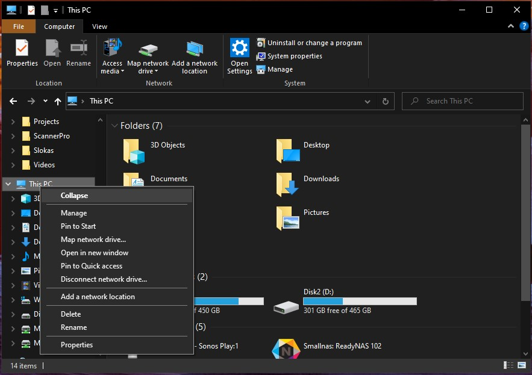

# Installation of Required Tools

You will need the following software tools for following along this book

- Git: A version control software. You will use this to get a copy of the code in this book from our Git repository.
- GCC for ARM: A compiler to compile your programs into binary.
- QEMU: This is a software emulator that we will use to emulate the Raspberry Pi
- Make tool for windows

## Git

Download the installer from [here](https://git-scm.com/download/win) and follow the instructions in the installer.

In your home directory create a subdirectory named "low_level_prog". Navigate to that directory in Windows Power Shell. Then type the following to checkout code from the repository:

```
git clone https://github.com/hrishim/llvl_prog1_code.git
```

**FIXME:** Pradeep, Does git need to be added to the path

## GCC compiler

The compiler is available as a free download from [here](https://developer.arm.com/downloads/-/gnu-a). The specific version you need for **Windows 10** is under the "Windows mingw" section and the "aarch64-none-elf" version. Download the *.tar.xz* file.

This is a compressed archived file containing all the compiler, assembler and disassembler tools needed for this book. To extract these files you will need a program like [7-zip](https://www.7-zip.org/). Once you install 7-Zip you can open the tar.xz file using that program. 

Opening the archive file will give you a directory. Move that directory to your home directory (in windows this will be C:\Users\<Your_User_Name>)

**FIXME:** Pradeep Where do we want the users to place the directory. Does it have to be added to path?

## QEMU

### Windows 10
Preferably running 64-bit Windows 10

1. Download [QEMU](https://www.qemu.org/download/#windows) and click on 64-bit version (select the 32-bit version if you are using 32-bit Win 10)
2. Download the latest released installer executable
3. Run installer and follow instructions to install

**Setting the path:**
Open any directory and locate "This PC" on the side panel and right-click. Select Properties.



In the System Properties panel select Advanced System Settings and in the "Advanced" tab click on "Environment Variables"

Select Path and click Edit then select New and add this path

C:\Program Files\qemu

**Test if its working:**

Open Windows PowerShell (Click on the search icon in the tool bar and type PowerShell, run the program),

In PowerShell type:

C:\> qemu-system-X86_64 --version

You should see an output like below. The version you see may be different and that is OK.

```
QEMU emulator version 5.2.94 (v6.0.0-rc4-11866-ge0e530b830-dirty)
Copyright (c) 2003-2021 Fabrice Bellard and the QEMU Project developers
``


**Additional help (external link):** [Installing QEMU on Windows](https://www.youtube.com/watch?v=SHMUMeEzSS0) (see the path setting)
 